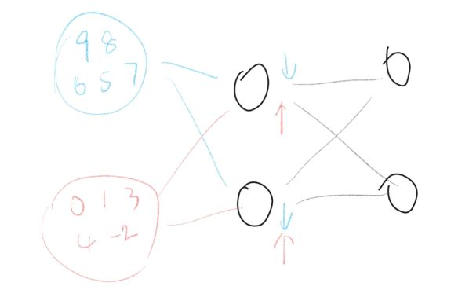
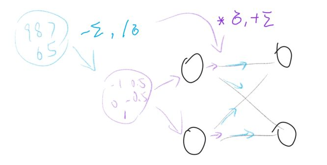
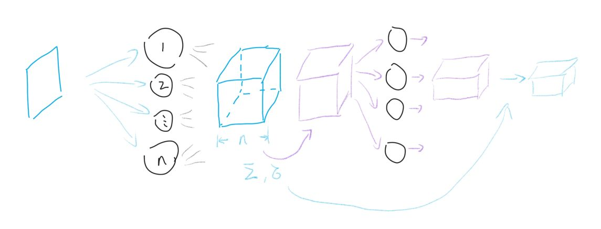

# Layer Normalization 笔记

## 为什么要做normalization

### Internal Covariate Shift

对于神经网络的各层输出经过了层内操作作用, 其分布会与各层对应的输入信号分布不同, 而且差异会随着网络深度增大而增大, 这就导致了最后输出的结果和原来的结果存在分布上的显著差异

### ICS带来的问题

1. 上层参数需要不断**适应新的输入数据分布**, 降低学习速度.

2. 下层输入的变化可能趋向于变大或者变小, **导致上层落入饱和区, 使得学习过早停止**. 尤其是sigmoid这样的函数, 如果下层趋于输出较大数值, 那么下层输出不管怎么变化都很难影响到上层的输入

3. 每层的更新都会影响到其它层, 因此每层的参数更新策略需要尽可能的谨慎.

### 解决ICS的方案: Normalization

在将数据送给神经元之前，先对其做平移和伸缩变换， 将它的分布规范化成在固定区间范围的标准分布.

## Normalization的具体方法

### batch normalization

在将一批数据送入模型前先将数据进行归一化  
BN独立地规范化每一个输入维度$x_i$  

#### 为什么要变回去?

1. 为了让底层输出能较大的影响到上层输入. 如果每次都把他规范到同一个分布, 那么底层的变化将不被上层重视
2. 为了充分利用神经网络变化的非线性部分. 规范化会将几乎所有数据映射到激活函数的线性区, 降低模型的表达能力

#### BN有什么缺点?

1. BN特别依赖Batch Size. 当Batch Size很小的时候, Batch的分布不能反映整体分布, 会对训练带来不利影响
2. BN对处理序列化数据的网络比如RNN是不太适用的. 当到较高层后, 可能在一些维度上只有少数样本还有数据, 基于这个样本的统计信息不能反映全局分布, 所以这时BN的效果并不好. 此外如果在测试时我们遇到了长度大于任何一个训练样本的测试样本，我们无法找到保存的归一化统计量, 所以BN无法运行.
3. BN只在训练的时候用, inference的时候不会用到, 因为inference的输入不是批量输入.

### Layer Normalization

#### 做法

根据通道进行归一化, 综合考虑一层所有维度的输入，计算该层的平均输入值和输入方差, 然后用同一个规范化操作来转换各个维度的输入.

优势:  

- 解决了在序列性/卷积神经网络里的归一化问题
- 可以在在线学习时对单一样本进行归一化
- 不需要保存mini-batch的均值和方差, 节省了额外的存储空间

不足:

- 如果不同输入特征不属于相似的类别(比如颜色和大小), LN的处理可能会降低模型的表达能力

