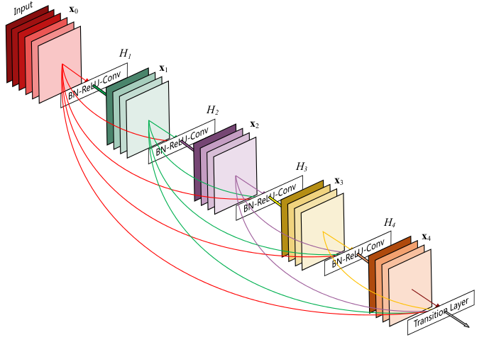

# 对历年冠军CNN的理解

## LeNet

意义: 定义了CNN的基本组件, 是CNN的鼻祖

结构:

创新:

- 局部感受野(local receptive fields): 利用卷积操作, 保留了图像局部结构, 同时减少了网络的权值

- 权值共享(shared weights): 同样是卷积操作, 同时减少网络的权值参数

- 下采样(sub-sampling): 利用池化, 使模型对平移和形变更加鲁棒, 实现特征的不变性, 同时起到了一定的降维的作用

## AlexNet

意义: 带来了深度卷积网络的高潮

结构:

创新:

- 更深的网络, 带来了更多非线性变化, 加强了网络的表达能力
- 数据增强, 减轻了过拟合的问题
  - 随机裁剪
  - 水平翻转
  - 测试时也进行了裁剪
  - 对RGB空间的主成分进行高斯扰动
- 使用ReLU代替sigmoid, 加快收敛
- 使用dropout, 进一步减轻了过拟合
- 局部响应归一化, 避免relu输出的值响应太大(听说这个操作没啥效果...)
- 重叠的池化层, 减轻过拟合

## ZF-Net

意义: 没啥特殊意义

结构:

创新:

- 相比于AlexNet, 调了参
- 没了

## VGG-Net

意义: 在当时看来**相当深**

结构:

创新:

- 使用小的卷积核, 配合更深的网络, 在保证提取范围的同时减少了参数数目, 增强了非线性变化数量, 增模型强了表达能力

## GoogLeNet

意义: 使用了了除了增加深度以外的网络结构

结构:

创新:

- 引入了Inception结构, 用多种方式对输入进行了提取, 此外, 1*1的卷积核还起到了降维/减少计算量的效果
- 中间层加入了loss单元, 更加重视低维特征, 加快收敛
- 最后用全局池化代替全连接, 在不影响精确的的前提下提高了计算速度

## ResNet

意义: 解决了加深网络反而导致效果变差的问题

主要思想:

通过向网络输入先前的输出, 保证加深模型至少不会得到更差的结果

结构:

创新:

- 将学习目标转换成输入输出之间的残差, 明显减小了模块中参数的值从而让网络中的参数对反向传导的损失值有更敏感的响应能力
- 用bottleneck模块调整输入的维度

## DenseNet

意义: 吸收了ResNet的精华

结构:

创新:

- 在DenseBlock里的层密集连接, 缓解梯度消失问题, 加强特征传播, 鼓励特征复用, 减少了参数量
