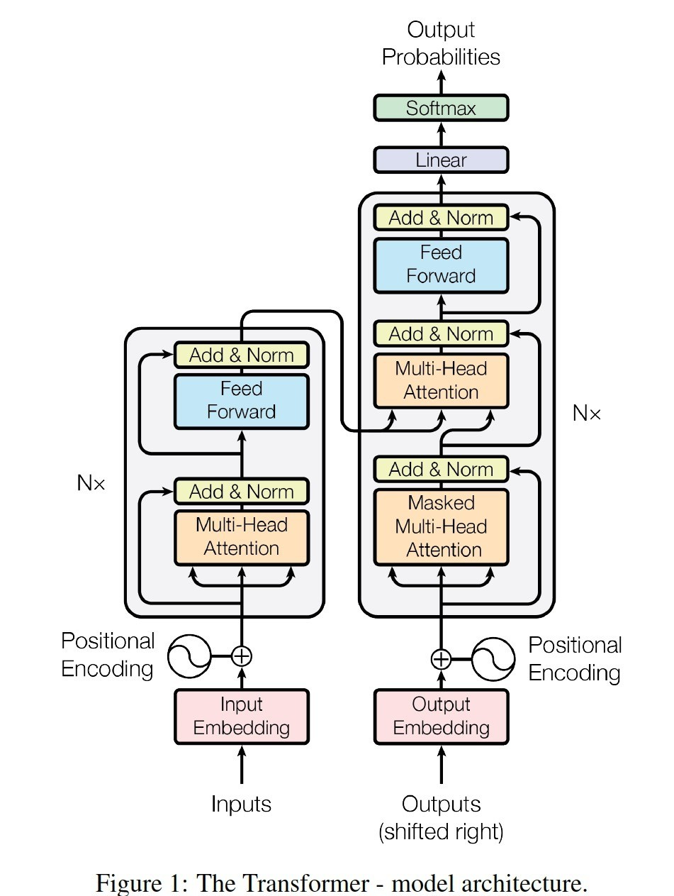
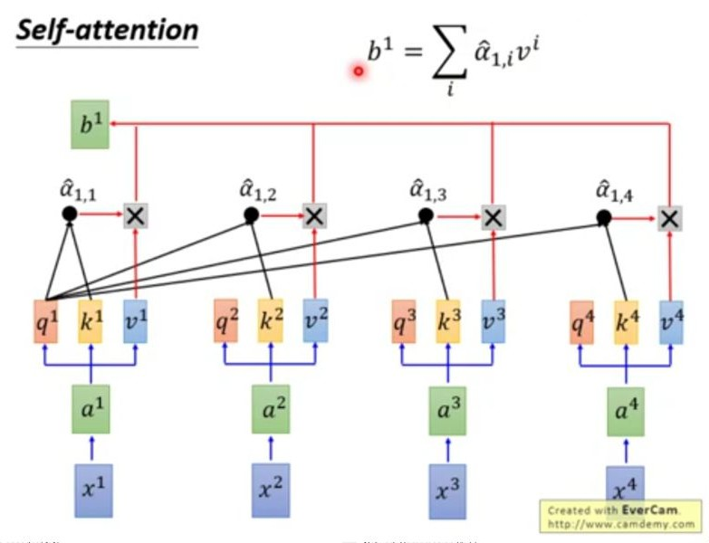
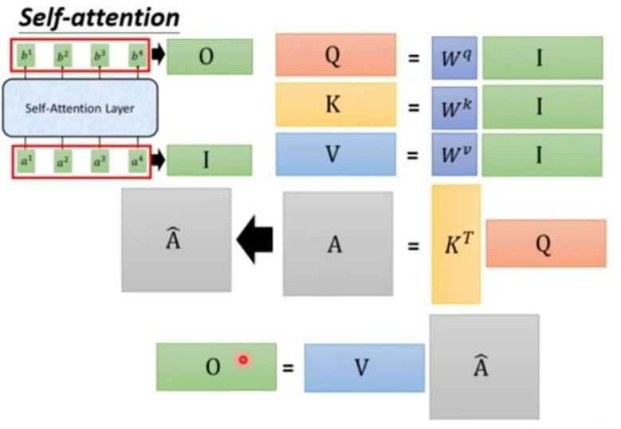

# Attention Is All U Need

## Why Is Attention

Attention的提出是为了解决序列处理过程中的以下问题:

1. 用RNN存在训练不能并行的问题
2. 用Conv1D存在难以捕捉全局信息的问题

作者提出了Attention以解决上述问题

## What Is Attention

将序列中的每个元素乘上一个3种变换矩阵, 分别得到query, key, value, 将每个元素的Q点乘其他元素的K, 再乘以它的V, 得到的就是对这个元素进行了全局信息提取的结果

## How Is Attention

具体到计算上, 只用进行少量矩阵乘法就可以实现特征的提取:

