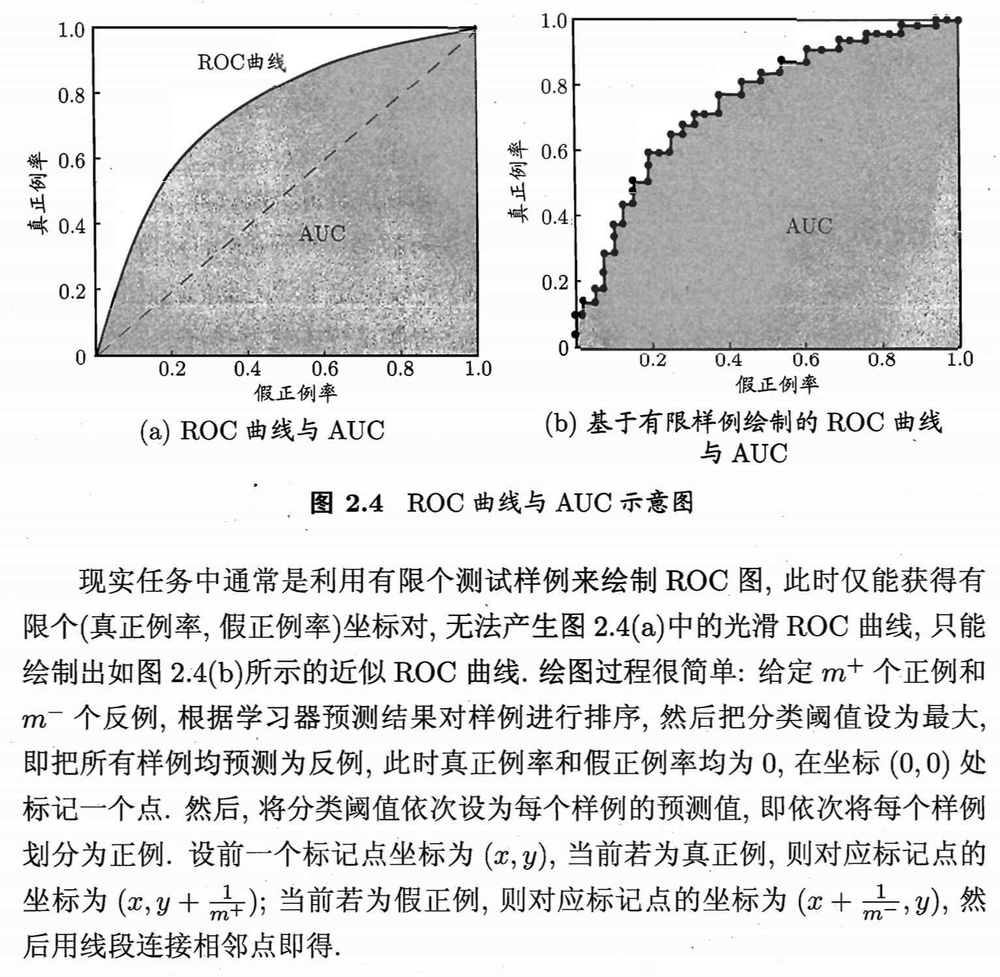
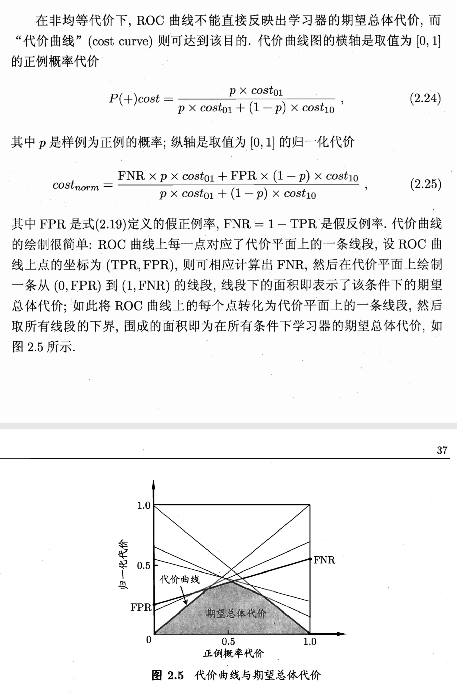
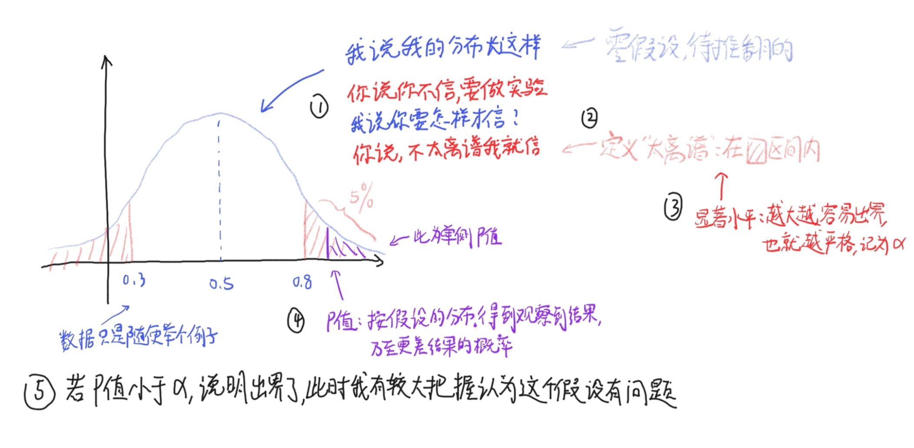

# 周志华《机器学习》笔记

## 1 绪论

略  

## 2 模型评估与选择

### 2.1 经验误差与过拟合

若可彻底避免过拟合，则通过经验误差（training error）最小化就能获得最优解，这就意味着我们构造性的证明了$P = NP$，因此，只要相信$P\not ={NP}$，过拟合就不可避免  

### 2.2 评估方法

选取尽可能与训练样本不同的测试集  

#### 2.2.1 留出法

通常留出1/5~1/3  

#### 2.2.2 交叉验证

将样本划分为K个互斥子集

#### 2.2.3 自助法

给定包含m个样本的数据集D，我们对他采样得到数据集D'：每次从D中有放回的抽样，重复m次，用D'作训练集，D - D'作测试集  

- 在数据集小、难划分训练/测试集时很有用  
- 但是改变了数据的分布，会引入估计偏差，数据够多一般不用此方法  

#### 2.2.4 调参

略  

### 2.3 性能度量

分类问题中常用的性能度量  

#### 2.3.1 错误率与精度

二分类中常用，也可适用于多分类  
用$f$模型来衡量样例集$D$的错误率：  
$$
E(f;D)=\frac{1}{m}\displaystyle\sum_{i=1}^{m}\mathbb{I}(f(x_i)\not ={y_i})
$$
精确度：
$$
acc(f;D)=1-E(f;D)
$$
更一般的，对数据分布${D}$和概率密度函数$p(\cdot)$，错误率：  
$$
E(f;D)=\int_{x\sim D}\mathbb{I}(f(x)\not =y)\cdot p(x)\space dx
$$

#### 2.3.2 查准率、查全率与F1

> precision/racall

**混淆矩阵：**

| 实际\预测      | 预测为真 | 预测为假 |
| -------------- | :------: | :------: |
| 为真(positive) |    TP    |    FN    |
| 为假(nagetive) |    FP    |    TN    |

**查准率P**(挑出的瓜有多少是好的）和**查全率R**（所有好瓜有多少被挑出来了）分别定义为：  
$$
P=\frac{TP}{TP+FP}
$$
$$
R=\frac{TP}{TP+FN}
$$

度量模型好坏：F1度量（更一般地，$F_\beta$度量）：
$$
\frac{1}{F_\beta}=\frac{1}{(1+\beta^2)}\times(\frac{1}{P}+\frac{\beta^2}{R})
$$

- $\beta$反映了对P，R重视程度
- F1是$\beta=1$的情况
- 和算术平均/几何平均相比，调和平均更重视较小值

对于有多个混淆矩阵的情况（如多次测试/多个数据集上测试/多分类）有两种做法：

1. 各矩阵上分别计算P，R，取平均，计算F1（macro）
2. 平均各个混淆矩阵，再计算P，R，F1（micro）

#### 2.3.3 ROC与AUC

> Receiver Operating Characteristic / Area Under Curve

反映的是『对结果预测置信度**排序能力**』的好坏：先把所有点设为F（阈值设为最大，从(0,0)开始），从高到低，依次把点设为正例（逐步降低阈值），如果是真正例就向上走一步（让AUC变大更快），否则向右走一步  
loss = 1 - AUC  

#### 2.3.4 代价敏感错误率与代价曲线\？?不太懂

对于不同类型错误造成的代价不一样的情况（如误判健康人为不健康/误判不健康为健康），可为错误赋予非均等代价  

| 实际\预测 |    第0类    |    第1类    |
| --------- | :---------: | :---------: |
| 第0类     |      0      | $cost_{01}$ |
| 第1类     | $cost_{10}$ |      0      |

先前的性能度量大多隐式的假设均等代价，计算的是错误**次数**而非**总体代价**  

### 2.4 比较检验

存在的问题：

1. 训练和测试的结果有差异
2. 结果与测试集的属性有很大联系
3. 随机性

解决问题的重要方法：**假设检验**  
通过统计来判断一个命题的真伪，需要量化一个评判标准$\alpha$  
可能的情况:

1. 标准太严，拒绝了本来为真的假设，记为$\alpha$，称之为显著水平(离谱水平)
2. 标准太松，接受了本来为假的假设。在一定的$\alpha$下我们希望受伪的概率越小越好。记受伪概率为$\pi=1-P(接受H_0|H_0为假)$，称之为检验的势。即在不冤枉好人的前提下最能发现坏人

> 记training error为$\hat{e}$，实际（泛化）错误率为$e$

#### 2.4.1 假设检验

在有m个样本的测试集上，泛化错误率为$e$的模型被测得错误率（training error）为$\hat{e}$的概率：  
$$
P(\hat{e};e)=\left(^m _{\hat{e}\times m}\right)\cdot e^{\hat{e}\times m}\cdot (1-e)^{m-\hat{e}\times m}
$$

已知training error的情况下，解$\partial P(\hat{e};e)/\partial e=0$有，$P(\hat{e};e)$在$e=\hat{e}$时最大  
假设$e\leqslant e_0$，则计算$\alpha$显著度下的临界$\bar{e}$，若测试错误率$\hat{e}$小于临界值$\bar{e}$，则可以得出结论：在$\alpha$显著度下不能拒绝$e\leqslant e_0$的假设，即能以$1-\alpha$的置信度认为泛化错误率不大于$e_0$  

对于多次测试的情况，可以使用"t检验"  
假定我们得到了k个错误率$\hat{e}_1,\hat{e}_2,...,\hat{e}_k$，则平均错误率$\mu$和方差$\sigma^2$为：  
$$
\mu = \frac{1}{k}\displaystyle\sum_{i=1}^{k}\hat{e}_i
$$
$$
\sigma^2 = \frac{1}{k-1}\displaystyle\sum_{i=1}^k(\hat{e}_i-\mu)^2
$$

考虑这k个测试错误率可以看作泛化错误率$e_0$的独立采样，则变量  
$$
\tau_t = \frac{\sqrt{k}(\mu-e_0)}{\sigma}
$$
服从自由的为k-1的t分布（详情见下文）。对假设"$\mu=e_0$"和显著度$\alpha$，我们可以计算在均值为$e_0$时，在$1-\alpha$概率内应该观察到的最大错误率（临界值），这里要考虑双边假设，两边“出界范围”都是$\alpha/2$，若平均错误率$|\mu-e_0| \in [t_{-\alpha/2},t_{\alpha/2}]$（在认为合理的面积内），则不能拒绝假设"$\mu=e_0$"，即有$1-\alpha$的置信度认为泛化错误率为$e_0$。

##### t检验云云

？?不知道下面这段对不对。。。  

- 假设：A，B是同一个分布（$A～N(\mu_0,?)$，B是已知分布）
- 检验：取样出手头有的样本的概率大不大，根据直觉，这个概率应该和以下因素有关：
  - 样本平均值$\bar{x}$
  - 样本方差$s$
  - 采样数$n$

在用样本估计整体时，研究样本的**平均数的分布**，这个分布（记为分布S---我随便取得名字）是一个[ 方差是总体分布方差的$1/\sqrt{n},n$为样本量，期望与总体期望相同 ]的正态分布（*p.s. 抽样次数足够多才有这个结论，但如果原分布是正态分布就没有任何限制*）

综上，得出以下统计量：  
$$
\tau = \frac{\sqrt{n}\cdot|\bar{x}-\mu_0|}{s}
$$ 
这个量服从自由度为n-1的t分布（n趋于无穷时为正态分布），代表的是[ 假设母体A服从B分布，对它抽样应该得到的平均数分布 ]，再看手头的数据，他从这个分布里sample出来的概率有多大呢（用$\tau$反映差距），再把这个结果和置信区间比较来决定是否接受它。  

具体参见：
[t检验(知乎,啤酒)](https://www.zhihu.com/answer/296723303)|
[t检验(知乎,情书)](https://www.zhihu.com/answer/589141978)

#### 2.4.2 交叉验证t检验

目标：判断两个模型性能差异大不大，如果大就取用平均误差小的那个  
思路：先对两个模型喂入一样的数据（用k折的方法），对他们表现的差异进行t检验  
问题：训练集有一定的重叠，使得测试错误率并不独立（每个测试集都被使用了k-1次），会高估假设成立的概率，我们采用"5\*2交叉检验"  
做法：做5次2折交叉检验，仅计算第一次二折上的平均值，计算每次二折的方差  

#### 2.4.3 McNemar检验

|  A\B  |   正确   |   错误   |
| :---: | :------: | :------: |
| 正确  | $e_{00}$ | $e_{01}$ |
| 错误  | $e_{10}$ | $e_{11}$ |

假设两个模型性能相同，则应有$e_{01}=e_{10}$，变量$|e_{01}-e_{10}|$应该服从正态分布，均值为1，方差为$e_{01}+e_{10}$，因此变量
$$
\tau_{\chi^2}=\frac{(|e_{01}-e_{10}|-1)^2}{e_{01}+e_{10}}
$$

服从自由度为1的卡方分布