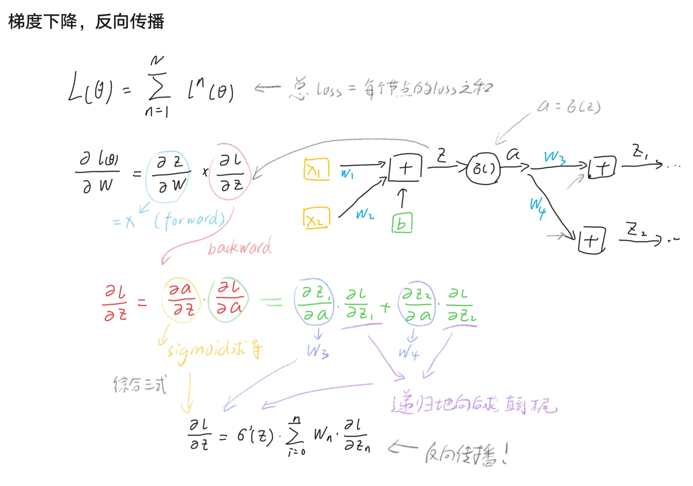

# 深度学习  
## 简述  
为什么要用深度学习?
- 有的实际问题并不是线性可分的，需要更复杂的模型  
  
什么是深度学习?
- 利用先前讲到的逻辑回归之类的模型作为"神经元"，多个神经元构成一个layer，多个layer搭在一起形成神经网络  

怎么进行深度学习?
- 反向传播，梯度下降

## 普通模型的一些问题及解决方案
- 梯度消失  
  - sigmoid函数不能很好的把变化传到深层的网络中，他会缩小变化  
  - 方案: ReLU/maxout 等函数替代sigmoid  
- 过拟合  
  - 过于复杂的模型会在训练时取得很好的结果，但是在测试时会表现很差    
  - 方案  
    - 正则化  
    - dropout  
    - early stop  

## MATH WARNING  


## demo  
来自[我的github](https://github.com/xiong35/my_code2242787668)
``` python
import matplotlib.pyplot as plt
from keras import layers
from keras import models
import numpy as np
from keras.datasets import imdb
(train_data, train_labels), (test_data,
                             test_labels) = imdb.load_data(num_words=10000)


def vectorize_sequences(sequences, dimension=10000):
    results = np.zeros((len(sequences), dimension))
    for i, sequence in enumerate(sequences):
        results[i, sequence] = 1.
    return results


x_train = vectorize_sequences(train_data)
x_test = vectorize_sequences(test_data)

y_train = np.asarray(train_labels).astype('float32')
y_test = np.asarray(test_labels).astype('float32')

model = models.Sequential()

model.add(layers.Dense(32, activation='relu', input_shape=(10000,)))
model.add(layers.Dropout(0.5))
model.add(layers.Dense(16, activation='relu'))
model.add(layers.Dropout(0.5))
model.add(layers.Dense(8, activation='relu'))
model.add(layers.Dropout(0.5))
model.add(layers.Dense(1, activation='sigmoid'))

model.compile(optimizer='adam', loss='mse',
              metrics=['accuracy'])

x_val = x_train[:10000]
partial_x_train = x_train[10000:]
y_val = y_train[:10000]
partial_y_train = y_train[10000:]

history = model.fit(partial_x_train, partial_y_train, epochs=12,
                    batch_size=512, validation_data=(x_val, y_val))

print(model.predict(x_test))

################################################################


history_dict = history.history
loss_values = history_dict['loss']
val_loss_values = history_dict['val_loss']

epochs = range(1, len(loss_values)+1)

plt.plot(epochs, loss_values, 'bo', label='Training loss')
plt.plot(epochs, val_loss_values, 'b', label='Validation loss')
plt.title('Loss')
plt.xlabel('Epoch')
plt.ylabel('Loss')
plt.legend()
plt.show()

plt.clf()

acc = history_dict['accuracy']
val_acc = history_dict['val_accuracy']

plt.plot(epochs, acc, 'bo', label='Training accuracy')
plt.plot(epochs, val_acc, 'b', label='Validation accuracy')
plt.title('Accuracy')
plt.xlabel('Epoch')
plt.ylabel('Acc')
plt.legend()
plt.show()

""" word_index=imdb.get_word_index()
reverse_word_index=dict([(value,key) for (key,value) in word_index.items()])
decoded_review=" ".join([reverse_word_index.get(i-3,"?") for i in train_data[0]])  
print(decoded_review) """

#test

```