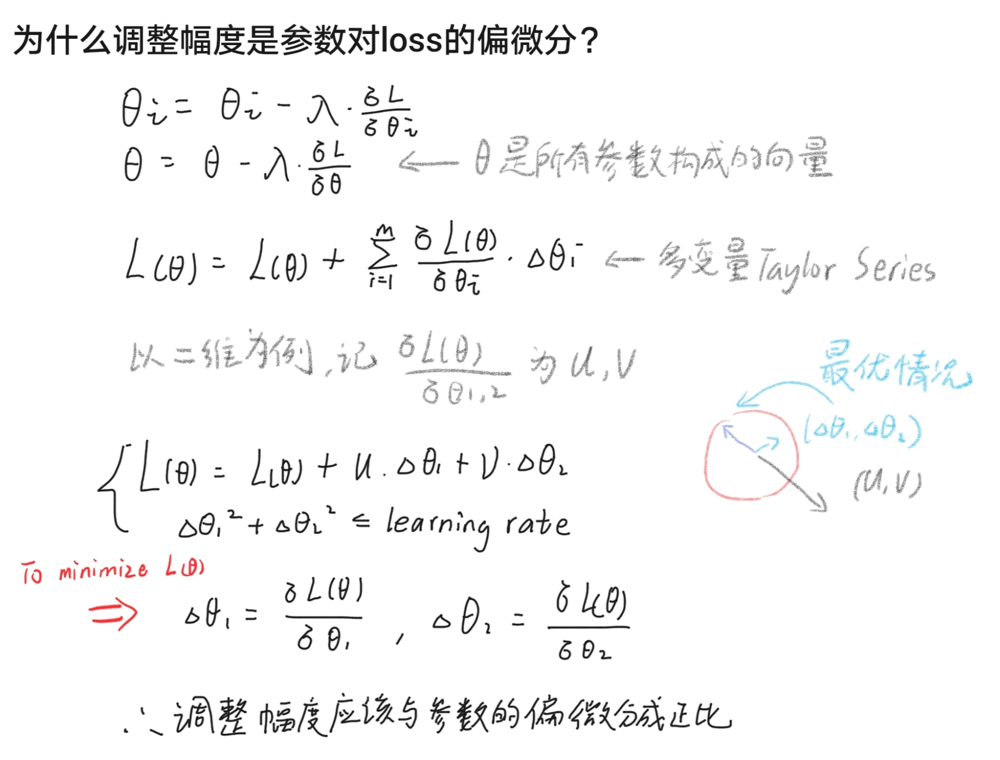

#  回归模型  
## 什么是回归模型
- 我们已经知道了一组数据，我们想通过他预测一个同类的输入会带来怎样的输出  
  
怎么预测呢?  
- 我们尝试用一条线来拟合尽可能准确的表示这些点，并认为在训练数据上取得的结果和测试时近似    
  
怎么拟合呢?  
- 一开始我们随便取一条线，结果当然很差。。。具体来说，我们计算预测值和实际值的差，取他们的几何平均数，并记为loss function，这个函数的输入是"曲线的参数"    
  
那怎么优化呢?
- 我们根据结果调整拟合方程的参数，偏差越大改得越多  
  
怎么定义"偏差大"?  
- 我们根据这个参数对总结果的影响程度调整，具体到数学，就是要计算参数对loss function的偏微分，并且把他乘上一个比例λ(记为learning rate)，把对应参数减去对应的值来调整  
  
但是调整一次并不够啊  
- 所以我们反复进行这个过程，直到参数不再发生显著变化 
    
## 一些改进方法
- 动态调整learning rate  
  - vanilla gradient decent  
  主要是根据时间降低lr  
  - adagrad  
  在前者的基础上考虑了二次微分，认为这个也会影响效果  
  - 动量  
  用来模拟物理情景，进行更好的优化
  - adam  
  集大成者，，一般用他就对了
  - [详细](https://m.sohu.com/a/149921578_610300)  
- 随机下降  
通过只利用部分样本带来的随机性减少局部最优的风险，加快学习速率    
一般采用mini batch的方法  
- 正则化  
通过约束参数们，不要让他们太大来防止过拟合
- feature scaling  
让数据尽量服从相近的分布，来平衡他们对loss的影响，加快收敛  

## MATH WARNING  
  

## demo 
引自[github](https://github.com/aymericdamien/TensorFlow-Examples)
``` python
'''
A linear regression learning algorithm example using TensorFlow library.

Author: Aymeric Damien
Project: https://github.com/aymericdamien/TensorFlow-Examples/
'''

from __future__ import print_function

import tensorflow as tf
import numpy
import matplotlib.pyplot as plt
rng = numpy.random

# Parameters
learning_rate = 0.01
training_epochs = 1000
display_step = 50

# Training Data
train_X = numpy.asarray([3.3,4.4,5.5,6.71,6.93,4.168,9.779,6.182,7.59,2.167,
                         7.042,10.791,5.313,7.997,5.654,9.27,3.1])
train_Y = numpy.asarray([1.7,2.76,2.09,3.19,1.694,1.573,3.366,2.596,2.53,1.221,
                         2.827,3.465,1.65,2.904,2.42,2.94,1.3])
n_samples = train_X.shape[0]

# tf Graph Input
X = tf.placeholder("float")
Y = tf.placeholder("float")

# Set model weights
W = tf.Variable(rng.randn(), name="weight")
b = tf.Variable(rng.randn(), name="bias")

# Construct a linear model
pred = tf.add(tf.multiply(X, W), b)

# Mean squared error
cost = tf.reduce_sum(tf.pow(pred-Y, 2))/(2*n_samples)
# Gradient descent
#  Note, minimize() knows to modify W and b because Variable objects are trainable=True by default
optimizer = tf.train.GradientDescentOptimizer(learning_rate).minimize(cost)

# Initialize the variables (i.e. assign their default value)
init = tf.global_variables_initializer()

# Start training
with tf.Session() as sess:

    # Run the initializer
    sess.run(init)

    # Fit all training data
    for epoch in range(training_epochs):
        for (x, y) in zip(train_X, train_Y):
            sess.run(optimizer, feed_dict={X: x, Y: y})

        # Display logs per epoch step
        if (epoch+1) % display_step == 0:
            c = sess.run(cost, feed_dict={X: train_X, Y:train_Y})
            print("Epoch:", '%04d' % (epoch+1), "cost=", "{:.9f}".format(c), \
                "W=", sess.run(W), "b=", sess.run(b))

    print("Optimization Finished!")
    training_cost = sess.run(cost, feed_dict={X: train_X, Y: train_Y})
    print("Training cost=", training_cost, "W=", sess.run(W), "b=", sess.run(b), '\n')

    # Graphic display
    plt.plot(train_X, train_Y, 'ro', label='Original data')
    plt.plot(train_X, sess.run(W) * train_X + sess.run(b), label='Fitted line')
    plt.legend()
    plt.show()

    # Testing example, as requested (Issue #2)
    test_X = numpy.asarray([6.83, 4.668, 8.9, 7.91, 5.7, 8.7, 3.1, 2.1])
    test_Y = numpy.asarray([1.84, 2.273, 3.2, 2.831, 2.92, 3.24, 1.35, 1.03])

    print("Testing... (Mean square loss Comparison)")
    testing_cost = sess.run(
        tf.reduce_sum(tf.pow(pred - Y, 2)) / (2 * test_X.shape[0]),
        feed_dict={X: test_X, Y: test_Y})  # same function as cost above
    print("Testing cost=", testing_cost)
    print("Absolute mean square loss difference:", abs(
        training_cost - testing_cost))

    plt.plot(test_X, test_Y, 'bo', label='Testing data')
    plt.plot(train_X, sess.run(W) * train_X + sess.run(b), label='Fitted line')
    plt.legend()
    plt.show()
```