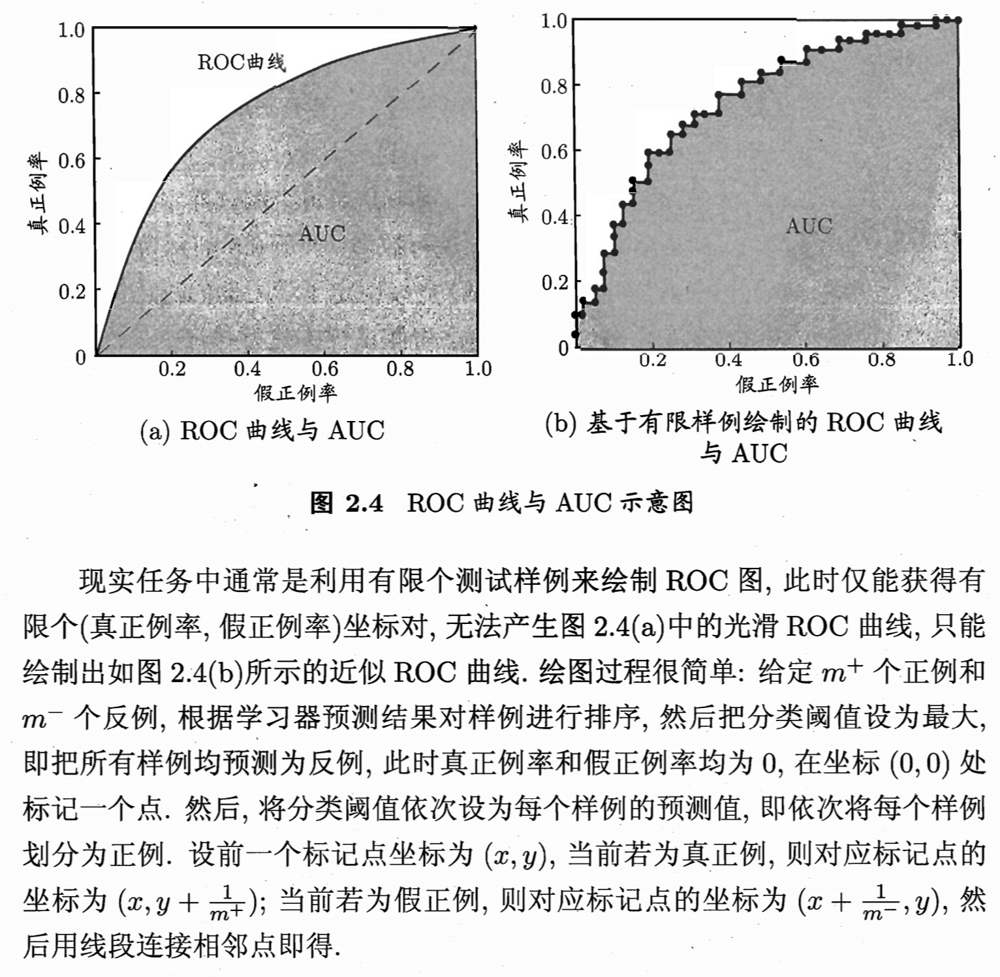
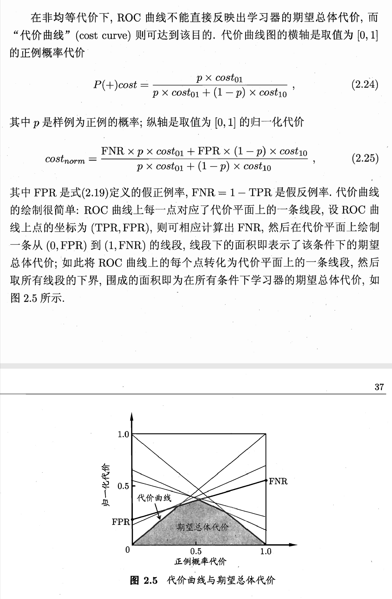

# 周志华《机器学习》笔记

## 1 绪论

略  

## 2 模型评估与选择

### 2.1 经验误差与过拟合

若可彻底避免过拟合，则通过经验误差（training error）最小化就能获得最优解，这就意味着我们构造性的证明了$P = NP$，因此，只要相信$P\not ={NP}$，过拟合就不可避免  

### 2.2 评估方法

选取尽可能与训练样本不同的测试集  

#### 2.2.1 留出法

通常留出1/5~1/3  

#### 2.2.2 交叉验证

将样本划分为K个互斥子集

#### 2.2.3 自助法

给定包含m个样本的数据集D，我们对他采样得到数据集D'：每次从D中有放回的抽样，重复m次，用D'作训练集，D - D'作测试集  

- 在数据集小、难划分训练/测试集时很有用  
- 但是改变了数据的分布，会引入估计偏差，数据够多一般不用此方法  

#### 2.2.4 调参

略  

### 2.3 性能度量

分类问题中常用的性能度量  

#### 2.3.1 错误率与精度

二分类中常用，也可适用于多分类  
用$f$模型来衡量样例集$D$的错误率：  
$$
E(f;D)=\frac{1}{m}\displaystyle\sum_{i=1}^{m}\mathbb{I}(f(x_i)\not ={y_i})
$$
精确度：
$$
acc(f;D)=1-E(f;D)
$$
更一般的，对数据分布${D}$和概率密度函数$p(\cdot)$，错误率：  
$$
E(f;D)=\int_{x\sim D}\mathbb{I}(f(x)\not =y)\cdot p(x)\space dx
$$

#### 2.3.2 查准率、查全率与F1

> precision/racall

**混淆矩阵：**

|实际\预测|预测为真|预测为假|
|---|:---:|:---: |
|为真(positive)|TP|FN|
|为假(nagetive)|FP|TN|

**查准率P**(挑出的瓜有多少是好的）和**查全率R**（所有好瓜有多少被挑出来了）分别定义为：  
$$
P=\frac{TP}{TP+FP}
$$
$$
R=\frac{TP}{TP+FN}
$$

度量模型好坏：F1度量（更一般地，$F_\beta$度量）：
$$
\frac{1}{F_\beta}=\frac{1}{(1+\beta^2)}\times(\frac{1}{P}+\frac{\beta^2}{R})
$$

- $\beta$反映了对P，R重视程度
- F1是$\beta=1$的情况
- 和算术平均/几何平均相比，调和平均更重视较小值

对于有多个混淆矩阵的情况（如多次测试/多个数据集上测试/多分类）有两种做法：

1. 各矩阵上分别计算P，R，取平均，计算F1（macro）
2. 平均各个混淆矩阵，再计算P，R，F1（micro）

#### 2.3.3 ROC与AUC

> Receiver Operating Characteristic / Area Under Curve

反映的是『对结果预测置信度**排序能力**』的好坏：先把所有点设为F（阈值设为最大，从(0,0)开始），从高到低，依次把点设为正例（逐步降低阈值），如果是真正例就向上走一步（让AUC变大更快），否则向右走一步  
loss = 1 - AUC  

#### 2.3.4 代价敏感错误率与代价曲线\？?不太懂

对于不同类型错误造成的代价不一样的情况（如误判健康人为不健康/误判不健康为健康），可为错误赋予非均等代价  

|实际\预测|第0类|第1类|
|---|:---:|:---: |
|第0类|0|$cost_{01}$|
|第1类|$cost_{10}$|0|

先前的性能度量大多隐式的假设均等代价，计算的是错误**次数**而非**总体代价**  

### 2.4 比较检验

存在的问题：

1. 训练和测试的结果有差异
2. 结果与测试集的属性有很大联系
3. 随机性

解决问题的重要方法：**假设检验**

> 记training error为$\hat{e}$，实际（泛化）错误率为$e$

#### 2.4.1 假设检验

在有m个样本的测试集上，泛化错误率为$e$的模型被测得错误率（training error）为$\hat{e}$的概率：  
$$
P(\hat{e};e)=\left(^m _{\hat{e}\times m}\right)\cdot e^{\hat{e}\times m}\cdot (1-e)^{m-\hat{e}\times m}
$$
已知training error的情况下，解$\partial P(\hat{e};e)/\partial e=0$有，$P(\hat{e};e)$在$e=\hat{e}$时最大  
$$

$$
